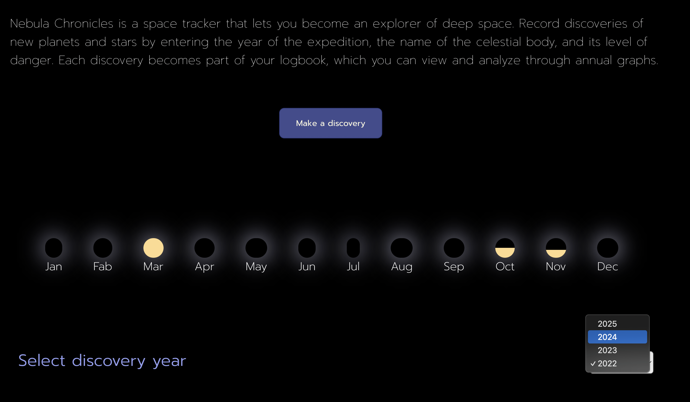
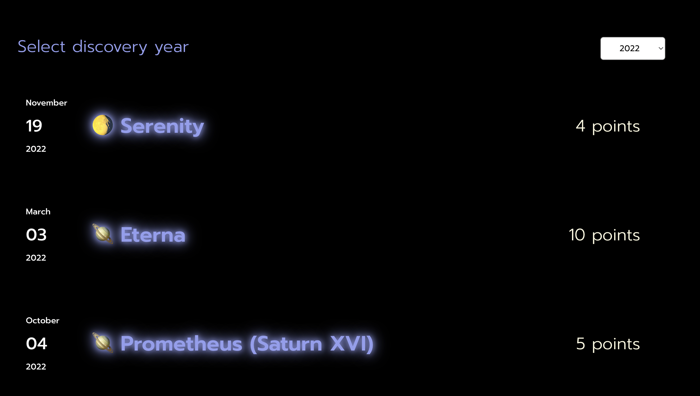
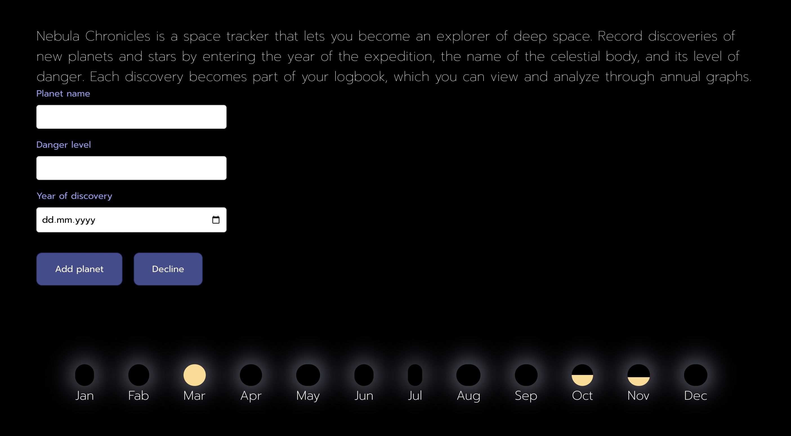

# Nebula Chronicles 🪐

---

🔎 Table of contents
- [Overview](#overview)
  - [The challenge](#the-challenge)
  - [Screenshots](#screenshots)
- [My process](#my-process)
  - [Built with](#built-with)
  - [What I learned](#what-i-learned)
- [Acknowledgments](#acknowledgments)

---

## Overview

This is a project I created to improve my skills with the React library and JavaScript.
The project includes a form with input fields that allow the user to add new information, and then filter the displayed cards by year. Additionally, the data is shown in a chart.

---

## The challenge

Organizing logic inside a component  
Passing data from child to parent component  

---

## Screenshots

---

## My process  

## Built with 

---

🪐 Semantic HTML5 markup    
🪐 CSS   
🪐 JS  
🪐 [Flexbox](https://css-tricks.com/snippets/css/a-guide-to-flexbox/#aa-flexbox-properties)      
🪐 [React](https://reactjs.org/) - library    
🪐 [Vite](https://vite.dev/) - project builder

---

## What I learned

Here’s what I worked on during the process:  

Component-based approach  
Passing props  
Working with hooks  
Passing data from the parent component to the child  
Passing data from the child component to the parent  
Displaying content based on conditions  
My own mockup design  

---

## Acknowledgments

💌 I thanks for my code reviewer, as well as my old dog, for the ultimate level of cuteness

